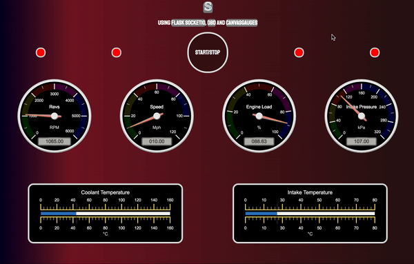

# Digital Dials
## What is it
This is a web app which allows you to get information from your car and display on live dials. This is soon to be covered in an episode of [T3chFlicks](https://t3chflicks.com).

## Installation
1. Clone this repo
2. Install pipenv
3. Install requirements `pipenv install`
4. Enter your virtual environment `pipenv shell`
5. Start app `export FLASK_APP=app.py; flask run;`
6. Plug your OBD-II device into your car and machine.
7. Open your browser at `http://127.0.0.1:5000/`
8. Click start and after about 8 seconds the values should start streaming in.

## Tech Used
* ELM-327 (device)
* pyOBD
* flask-socketIO
* CanvasGauges
